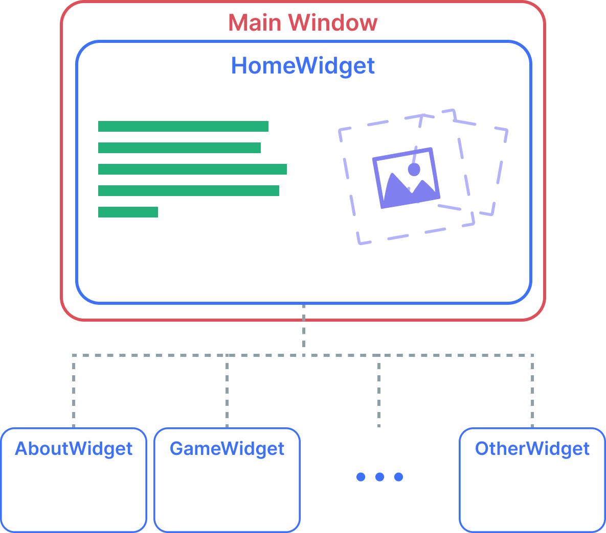
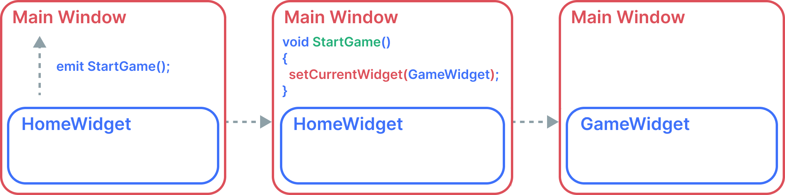

# Архітектура

## Система вікон

Програма розбита на так звані вікна. Це Qt віджети, які містять у собі який-небудь контент, наприклад вікно з приведенням, вікно з грою, вікно з виведенням інформації про програму тощо. Ці вікна контролюються в корені Qt віджета, таких як `MainWindow`.

На зображенні демонструється загальний вигляд цих вікон:

- Є головне MainWindow.
- MainWindow відтворює один із доступних віджетів.

Оскільки нам необхідно змінювати вікна за якихось дій користувача, віджети надсилатимуть сигнали, а `MainWindow` їх оброблятиме. Так, ми можемо логічно переходити на інші вікна, прив'язуючи сигнали дочірніх віджетів до зміни вікон.

Виглядає це приблизно так:

## Ігровий контролер

Віджети розв'язують проблему з поділом коду на рівні UI, але два різні віджети можуть вимагати одні й ті самі дані або ж змінювати стан гри, впливаючи на інші віджети. Для того, щоб спростити код між віджетами, ми використовуємо ігровий контролер `GameController`, який доступний глобально.

Він керує поточним станом гри і містить у собі прогрес самої гри, якщо її розпочато.
