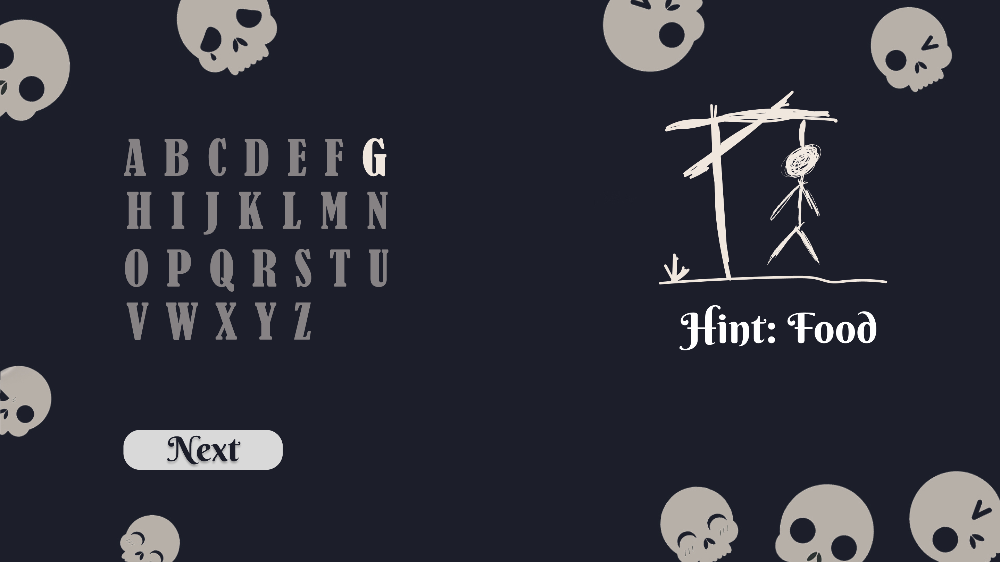
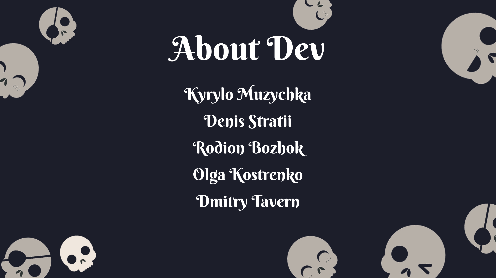

# Технічне завдання

## Екран: HomeWidget

Екран привітання містить у собі кнопки для початку гри і перегляд імен розробників.

## Екран: GameStartWidget

Екран старту гри містить поля для введення імені гравців, кнопку для початку гри і для виходу в головне меню.

### Поля

Поля мають такі обмеження:

- не менше 3 символів
- не більше 10 символів
- не має містити пробілів
- не повинен мати пробілів, символів перенесення на початку або наприкінці

### Кнопка почати гру

Якщо одне або кілька обмежень було порушено, кнопка **Start** має бути заблокована.

## Екран: GameWidget

Екран гри містить елементи для введення букви, відтворення шибениці, відтворення імені гравця, його прогресу з вгадування слова, а також підказку щодо загаданого слова. Так само для швидкого завершення гри передбачена можливість здатися, що автоматично зробить поточного гравця переможеним.

### Загадане слово

Загадане слово має такі обмеження:

- не більше 10 символів
- не містить пробілів
- не містить цифри, спецсимволи тощо.
- використовується виключно латиниці

### Прогрес

Прогрес за вгаданим словом виводиться у вигляді блоків, якщо гравець вгадав якусь букву, необхідно виводити її в цьому блоці.

### Вибір букв

Під час вибору літери для загаданого слова якщо буква:

- міститься в слові: оновлюється прогрес гравця і дається можливість гравцеві продовжити вибір букв.
- не міститься в слові: відмальовується наступний етап шибениці, прогрес за словом змінюється на кнопку "Next".

### Кнопка Next

Коли гравець не вгадує букву, замість прогресу з'являється кнопка **Next**. Після її натискання, стан гри змінюється на наступного гравця і тепер він може вибрати собі букву. При цьому, показується його прогрес.

Це потрібно, щоб:

- Приховати прогрес одного гравця від іншого.
- Дозволити показати кількість зроблених помилок.

## Екран: GameOverWidget

Екран кінця гри містить ім'я переможця, а також кнопки для виходу в головне меню і повтору гри з такими ж іменами гравців.

## Екран: AboutWidget

Екран інформації містить у собі імена розробників.

