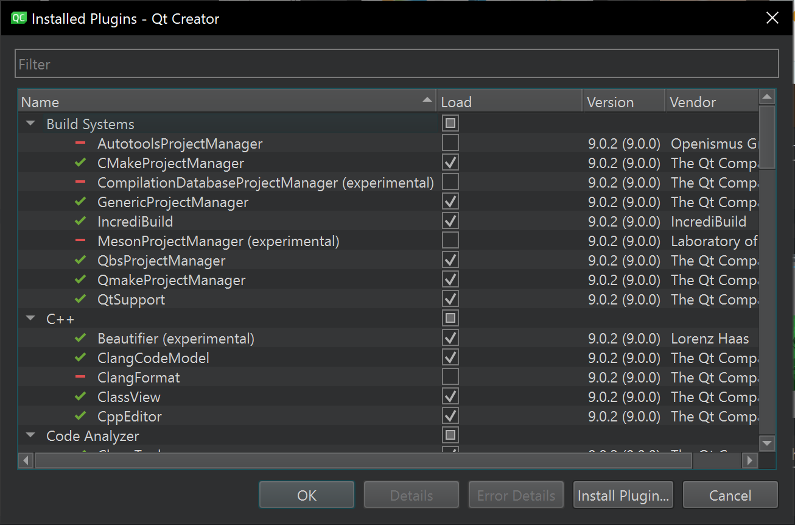
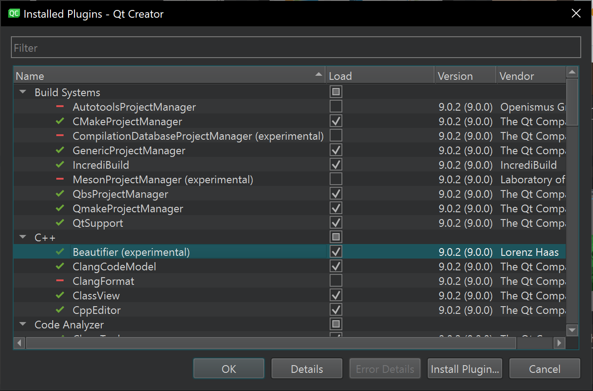
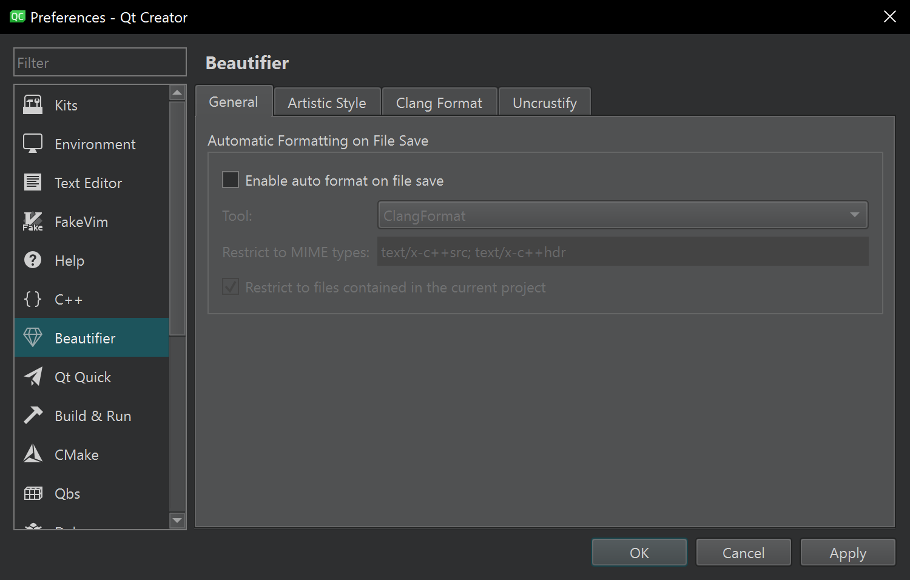
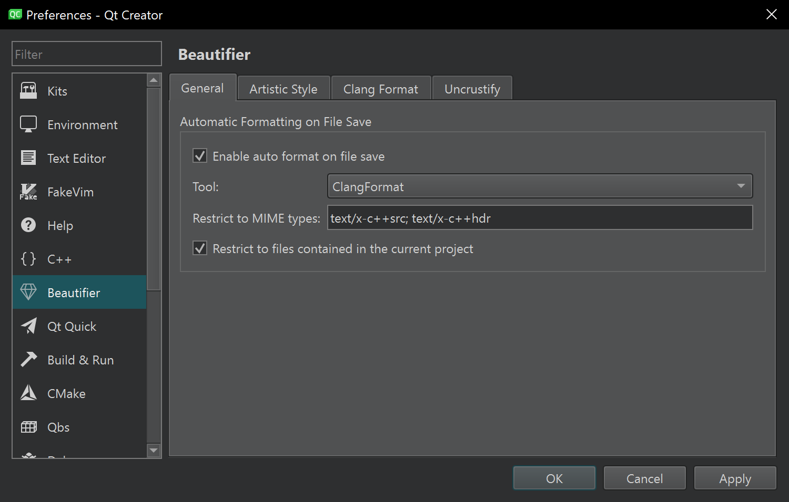
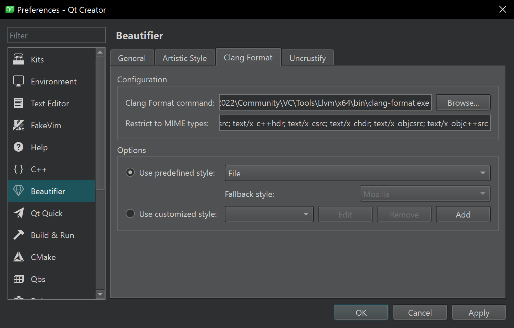

# Стиль коду

Дотримання єдиного стилю коду в програмуванні має кілька переваг. Він підвищує читабельність і розуміння коду, зменшує кількість помилок, спричинених невідповідностями в стилі написання, і спрощує супровід та оновлення коду в майбутньому. Тому, для ефективної роботи над проєктом, важливо дотримуватися загальних правил оформлення коду.

Для цього ми налаштуємо Qt Creator, який буде автоматично, при збереженні файлу, форматувати його.

## Увімкнення плагіна

Для того, щоб активувати автоформатування, необхідно увімкнути плагін. При виборі "Help -> About plugins" відкривається вікно плагінів Qt Creator.



Після відкриття вікна, необхідно поставити галочку навпроти плагіна "Beautifier" і перезавантажити Qt Creator.



## Налаштування плагіна

За замовчуванням, автоформатування не ввімкнено. Для того, щоб його ввімкнути, потрібно перейти в "Edit -> Preferences", і у вікні, що з'явилося, вибрати "Beautifier".



Тепер необхідно виставити галочку на "Enable auto format on file save", виставити "ClangFormat" у селекторі "Tool".



У вкладці "ClangFormat" потрібно вибрати шлях до виконуваного файлу clang-format.exe, який поставляється в MS Visual Studio C++.

```
C:\Program Files\Microsoft Visual Studio\2022\Community\VC\Tools\Llvm\x64\bin\clang-format.exe
```

У полі "Use predefined style" вибрати "File".



Після цього необхідно перевідкрити Qt Creator.

## Результат

Тепер, при збереженні будь-якого файлу з розширенням .cpp або .h, Qt Creator автоматично форматне код як прописано в конфігураційному файлі.
