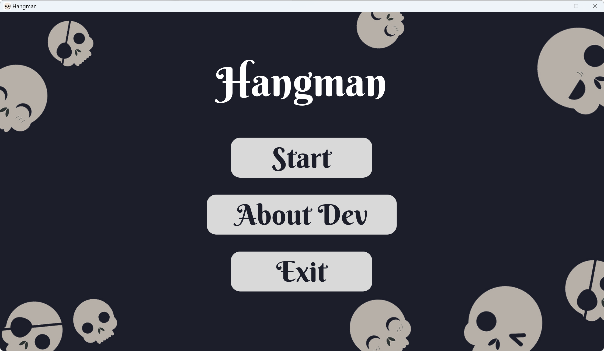
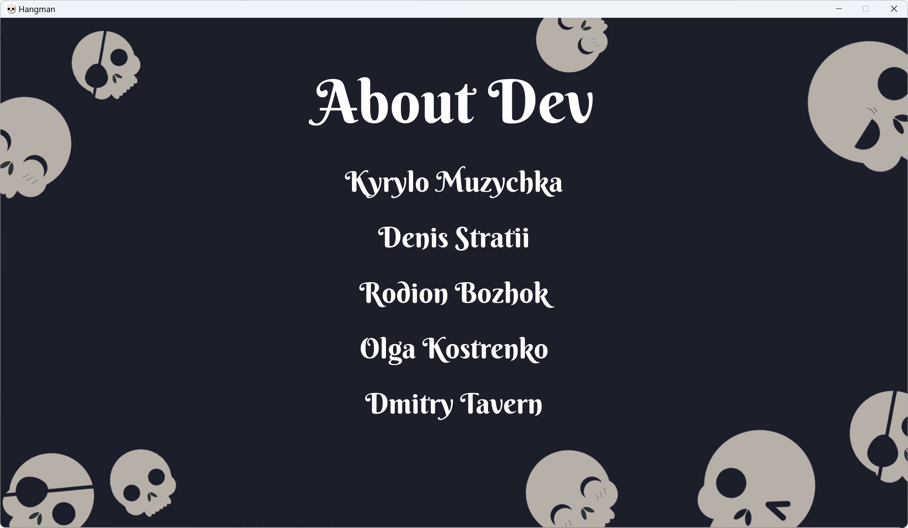
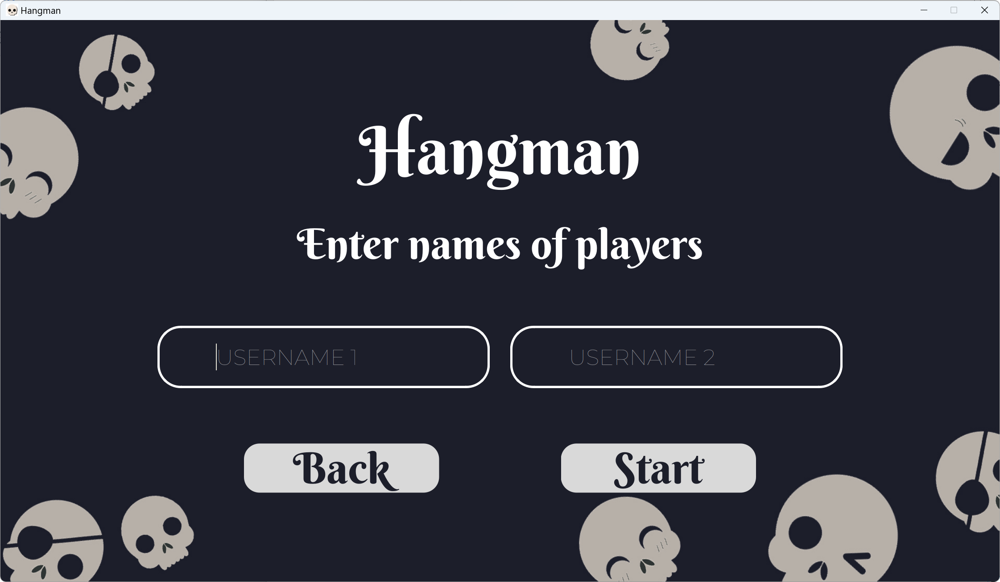
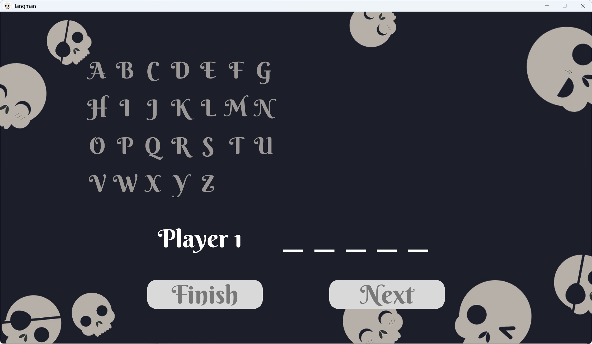

# Hangman

Hangman is a popular game in the world that sets the task of guessing a word from letters without completing the construction of the gallows, which is gradually built with each mistake.

For us, it's a university team project aimed at gaining experience in team Scrum development and going through all the stages of game development in a real project.

See [documentation](https://dmitrytavern.github.io/university-hangman/).

See [download](https://github.com/dmitrytavern/university-hangman/releases/latest) page.

## Screenshots

Home page:

About dev:

Game start:

Game play:

